# Pipeline como código no Jenkins

Olá pessoal! No meu primeiro post no Blog da Concrete, vamos falar sobre um modo diferente para criar Pipelines no Jenkins, **como código**!

Geralmente temos um certo trabalho com configuração quando precisamos criar uma estrutura de pipeline, pois envolve criação de múltiplos jobs, configuração do SCM, agendamento para execução, log rotation, arquivamento de artefatos, publicação de relatórios, etc.

Após a criação dos jobs necessários para o projeto é necessário configurar a ligação entre eles, informar ao job filho que terá que utilizar determinado artefato do job pai, e assim por diante. 

Todo esse processo leva tempo para configurar, dar manutenção e entender a relação entre os jobs, e já que não queremos perder tempo com isso, vamos criar apenas 1 job. Sim, eu disse **1 JOB**!

Mas como!? Vamos utilizar código para criar cada passo do nosso projeto! =]

### Código em Groovy

Para o Pipeline no Jenkins escrevemos em Groovy, uma linguagem desenvolvida para a plataforma Java, como alternativa à mesma. Ou seja, se você domina Java, não terá dificuldade alguma para pintar e bordar no Pipeline! =] 

Se não domina, não se preocupe, pois no Jenkins existe uma opção chamada **Pipeline Syntax**, que ajuda muito!!! 

Como falamos no início, nosso job será criado apenas com código, e com Pipeline temos duas maneiras de fazer.

1. Escrevendo o código diretamente no job.
2. Criando o "Jenkinsfile" na raíz do repositório, com o código.

Na minha opinão, a segunda forma é a mais legal, pois com o Jenkinsfile na raíz do repositório teremos todo o histórico de alterações no Git, e o desenvolvedor não precisará abrir o Jenkins para alterar qualquer vírgula no job.

### Sendo assim, mãos à obra!!!

Para nosso projeto vamos utilizar a versão 2.xx do Jenkins, um repositório do BitBucket e emulador ou dispositivo com Android.

Neste post não farei instalação/configuração do Jenkins. Utilizaremos o Docker, com o container ***jenkinsci/jenkins***, que já instala por padrão os plugins que utilizaremos, como "*Pipeline*", "*Git Plugin*", etc. 

#### Iniciando o Jenkins e criando o Job

Baixando o container:

	$ docker pull jenkinsci/jenkins

Iniciando o Jenkins com diretório de persistência e redirecionamento de portas:

	$ docker run -d --name jenkins -v /opt/jenkins:/var/jenkins_home -p 8080:8080 -p 50000:50000 jenkinsci/jenkins
	
Com o Jenkins em execução, vamos criar nosso job:

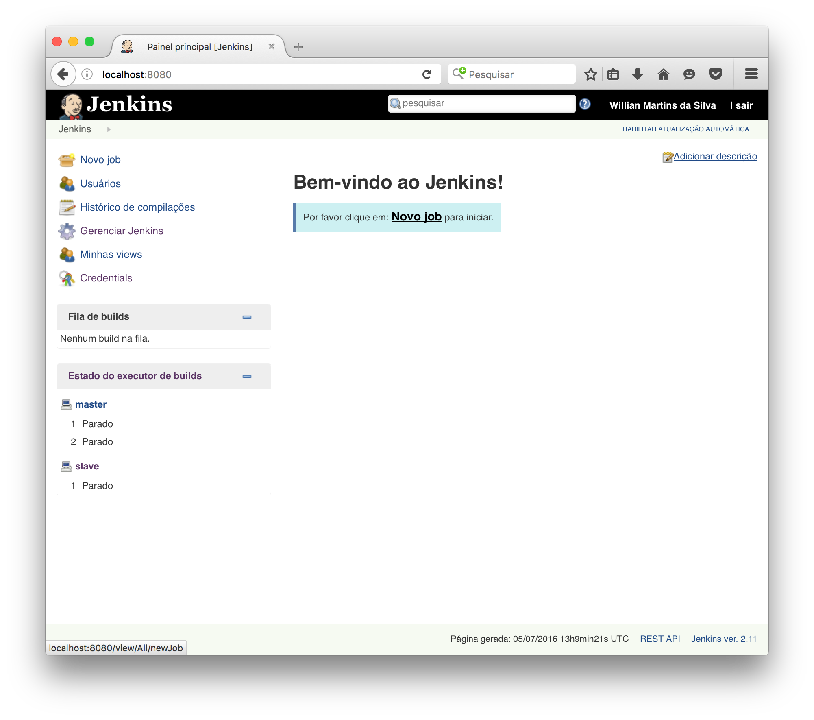

Vamos dar um nome ao job, informar que ele será um "Pipeline" e clicar em OK para criar:

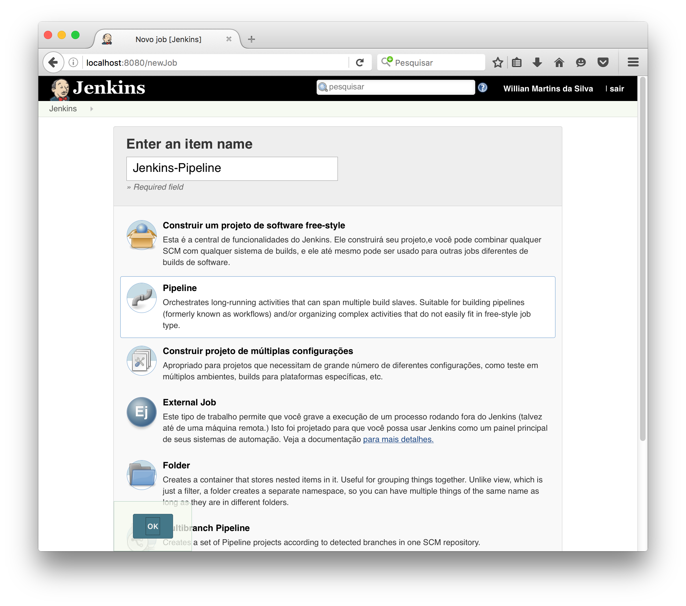

Configuração do job:

1. Navegar até o campo **Pipeline**.
2. Em **Definition** selecionar "*Pipeline script from SCM*" (Essa opção utiliza o Jenkinsfile contido no repositório).
3. Em **SCM** selecionar "*Git*".
4. Em **Repositories** vamos informar a URL do repositório em "*Repository URL*" e informar as credenciais em "*Credentials*".
5. Em **Branches to build** vamos informar a branch desejada em "*Branch Specifier*".
6. Em **Script Path** vamos informar o nome do nosso "*Jenkinsfile*", que neste caso, será Jenkinsfile mesmo.
7. Salve o job!

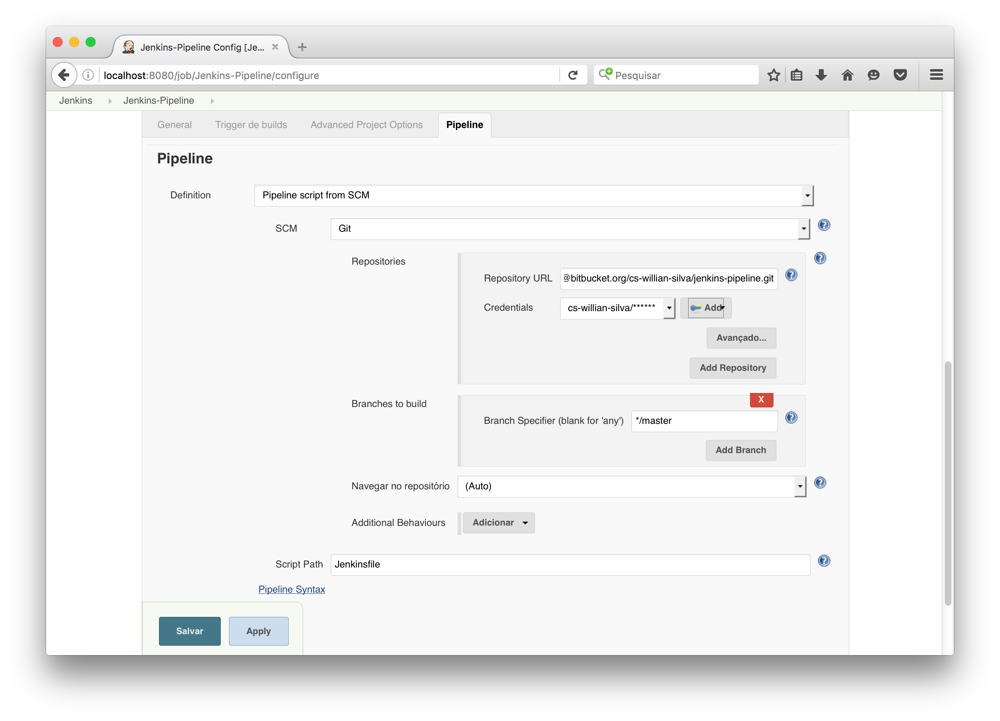

Pronto!!!

#### Iniciando o Jenkinsfile

Vamos criar este projeto utilizando o Jenkinsfile contido no repositório. Vamos inicía-lo!

Começaremos com o código abaixo:

	stage 'Checkout'
  		node('slave') {
	  		deleteDir()
	  		checkout scm
	}

- Este trecho de código criou o "**stage**" chamado "*Checkout*" (O nome do stage fica à seu critério).
- Em "**node**" foi definido que o job será executado no nó chamado "*slave*" (Caso não informe o nó, conhecido como "*slave*", o job será executado no Jenkins master).
- Foi adicionado "**deleteDir()**" para excluir o diretório clonado à cada início de build. 
- A opção "**checkout scm**" é para utilizar o repositório clonado.

Feito isso, ao construir nosso projeto, temos a execução:

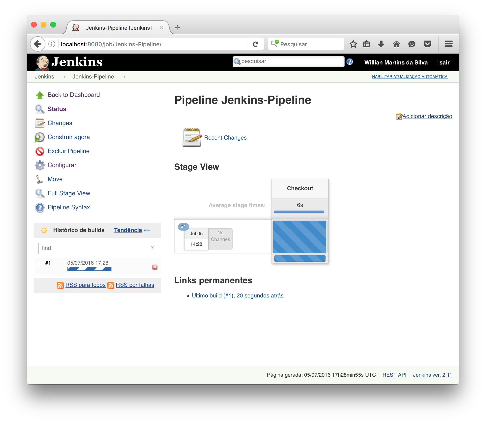

E o fim:

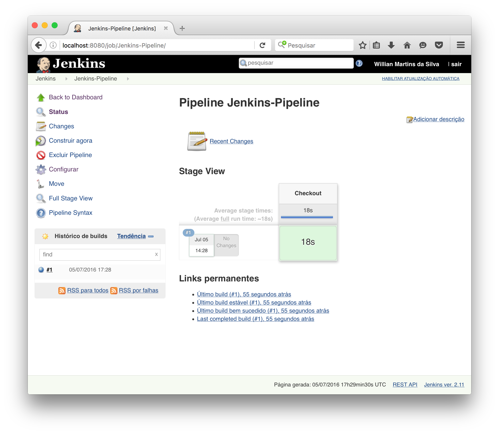

Legal! Já conseguimos clonar nosso repositório e iniciar o Pipeline. Agora vamos fazer um build do aplicativo e arquivar o artefato, que neste caso será o aplicativo gerado.

Para isso vamos conectar um dispositivo Android no Jenkins Slave, ou iniciar um emulador. Para nosso projeto, utilizarei o Genymotion para emular um dispositivo com Android.

Vamos ver o dispositivo conectado ao *slave*:

	$ adb devices
	List of devices attached
	192.168.56.101:5555	device

O nome do device é "192.168.56.101:5555". Vamos utilizá-lo à seguir.

No Jenkinsfile adicionamos o bloco:

	stage 'Build & Archive Apk'
	  node('slave') {
	    sh 'export ANDROID_SERIAL=192.168.56.101:5555 ; ./build.sh'
	    step([$class: 'ArtifactArchiver', artifacts: 'meu_aplicativo/build/outputs/apk/meu_aplicativo.apk'])
	}
	
- Para este stage demos o nome de "Build & Archive Apk".
- Mantivemos a execução no node "*slave*".
- Acrescentamos "**sh**", para utilizar Shell Script, onde exportamos a variável "ANDROID_SERIAL" com o nome do nosso dispositivo e na sequência chamamos um script que fará o build do aplicativo.
- Criamos um "**step**" para arquivar o aplicativo gerado utilizando "**ArtifactArchiver**", e passamos o caminho do aplicativo.

Nosso Jenkinsfile ficou assim:

	stage 'Checkout'
	  node('slave') {
	    deleteDir()
	    checkout scm
	}

	stage 'Build & Archive Apk'
	  node('slave') {
	    sh 'export ANDROID_SERIAL=192.168.56.101:5555 ; ./build.sh'
	    step([$class: 'ArtifactArchiver', artifacts: 'meu_aplicativo/build/outputs/apk/	meu_aplicativo.apk'])
	}
	
Vamos construir o projeto!

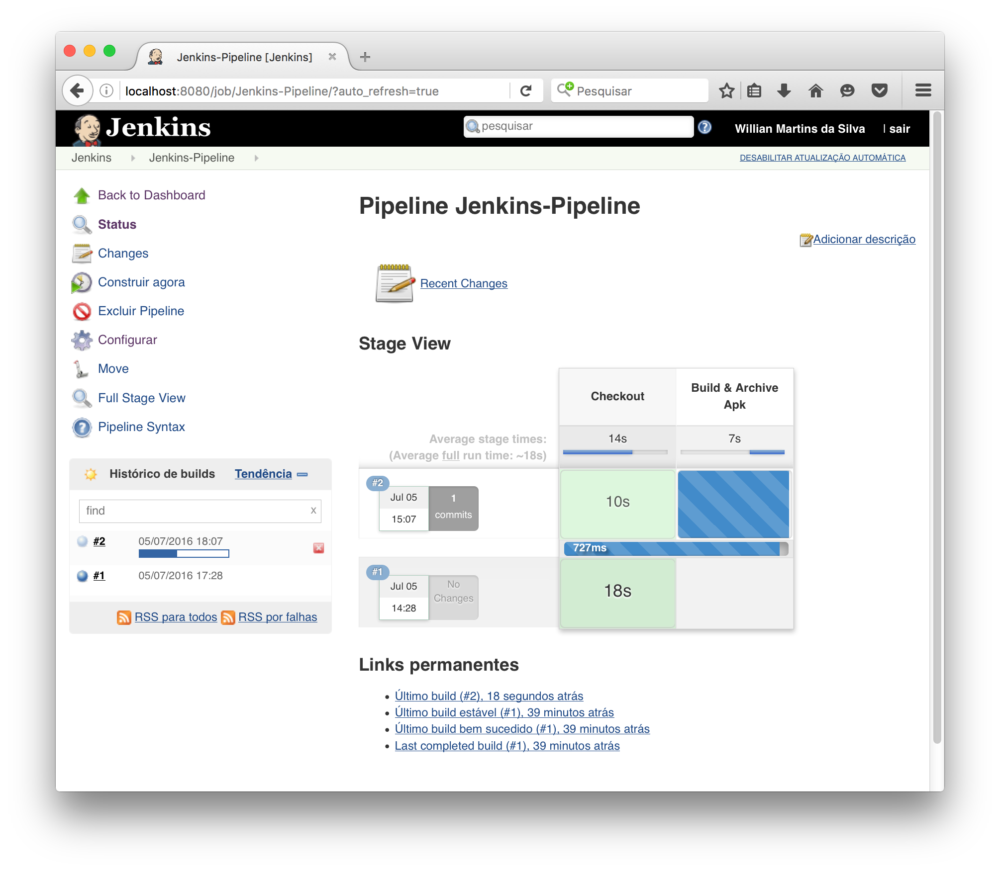

Como podemos ver, ao finalizar o primeiro stage, foi criado automaticamente o stage "*Build & Archive Apk*". 

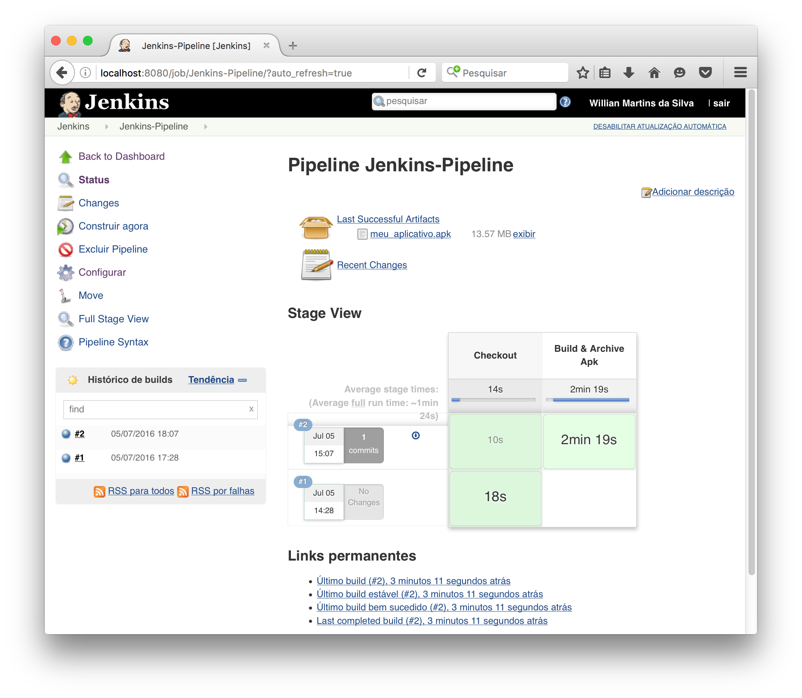

No fim, temos mais um stage finalizado, e em "**Last Successful Artifacts**" temos o aplicativo arquivado, "*meu_aplicativo.apk*".

Ae, está ficando bom! Pelo menos eu acho... rs

Vamos agora executar os testes e publicar os relatórios.

No Jenkinsfile, vamos adicionar:

	stage 'Run Tests'
	  node('slave') {
	    sh 'export ANDROID_SERIAL=192.168.56.101:5555 ; ./runtests.sh'
	    publishHTML(target: [reportDir: 'meu_aplicativo_testes/build/reports/androidTests/connected/', reportFiles: 'index.html', reportName: 'Testes Instrumentados'])
	    step([$class: 'JUnitResultArchiver', testResults: 'meu_aplicativo_testes/build/outputs/androidTest-results/connected/*.xml'])
	}
	
- Para este stage demos o nome de "Run Tests".
- Novamente estamos utilizando "**sh**" para exportar a variável com o nome do dispositivo Android, e na sequência executamos um script que fará os testes no aplicativo.
- Adicionamos "**publishHTML**" para publicar o relatório de testes, passamos o caminho, o arquivo que será publicado e o nome que daremos ao relatório.
- Adicionamos "**step**" para criar um gráfico de "*Tendência de resultados de teste*" utilizando "**JUnitResultArchiver**", e passamos o caminho dos arquivos XML.

O Jenkinsfile ficou assim:

	stage 'Checkout'
	  node('slave') {
	    deleteDir()
	    checkout scm
	}

	stage 'Build & Archive Apk'
	  node('slave') {
	    sh 'export ANDROID_SERIAL=192.168.56.101:5555 ; ./build.sh'
	    step([$class: 'ArtifactArchiver', artifacts: 'meu_aplicativo/	build/outputs/apk/meu_aplicativo.apk'])
	}

	stage 'Run Tests'
	  node('slave') {
	    sh 'export ANDROID_SERIAL=192.168.56.101:5555 ; ./runtests.sh'
	    publishHTML(target: [reportDir: 'meu_aplicativo_testes/build/reports/androidTests/connected/', reportFiles: 'index.html', reportName: 'Testes Instrumentados'])
	    step([$class: 'JUnitResultArchiver', testResults: 'meu_aplicativo_testes/build/outputs/androidTest-results/connected/*.xml'])
	}
	
Vamos construir!!!

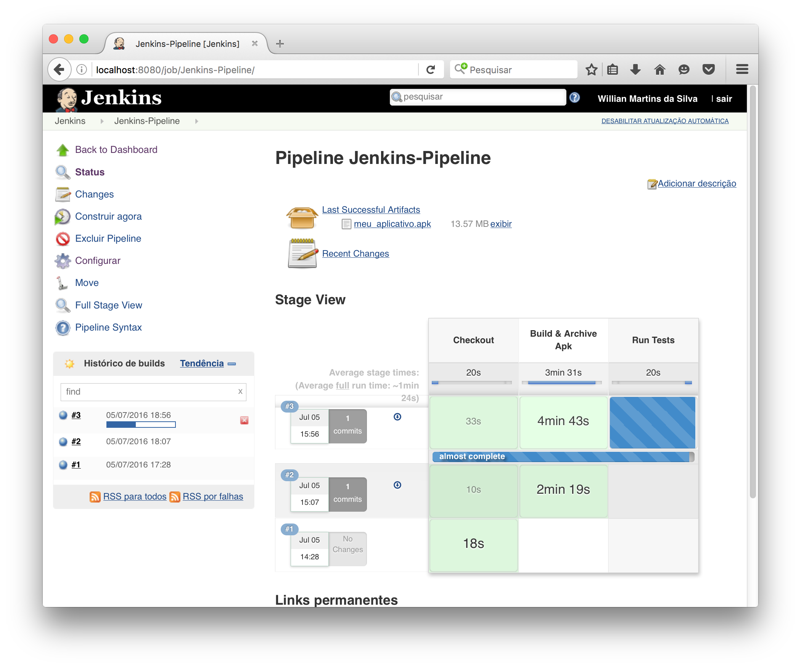

Podemos ver que o stage "*Run Tests*" foi criado automaticamente.

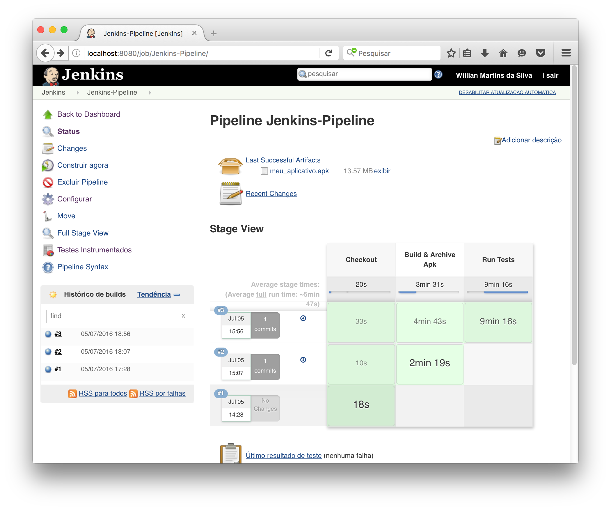

E no fim da construção, podemos ver que o relatório, chamado "*Testes Instrumentados*" foi publicado com sucesso!!! 

Mas opa, está faltando algo... O gráfico de "*Tendência de resultados de teste*". 

Não temos o gráfico porque precisamos arquivar pelo menos 2 jobs, para ter o ponto inicial e ponto final. 

Sendo assim, vamos executar novamente!

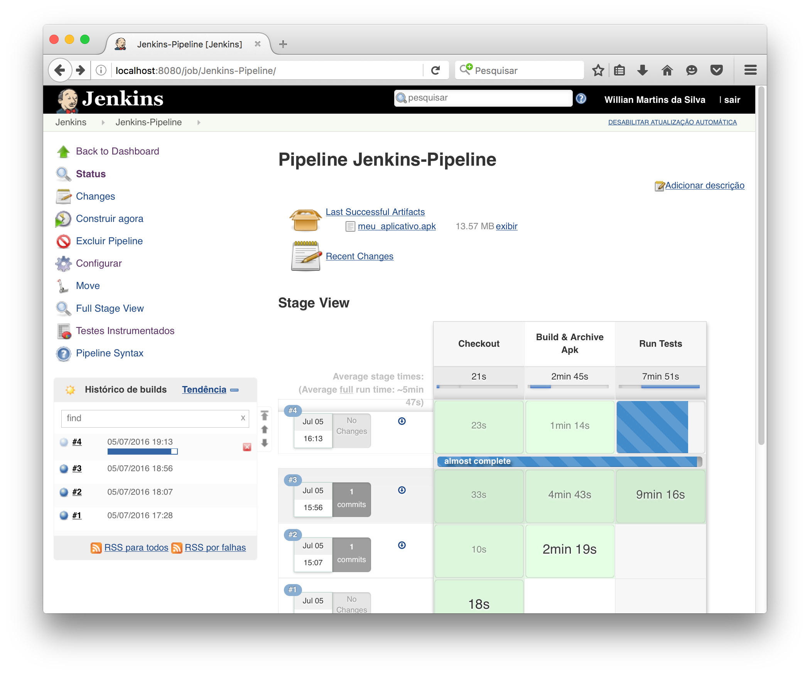

O Pipeline está sendo construído mais uma vez...

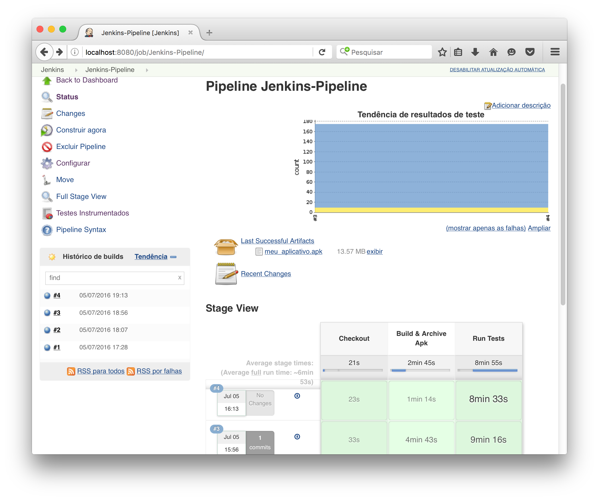

E no fim temos tudo que tínhamos antes, mais o gráfico de "*Tendência de resultados de teste*".

Mas e se algum step quebrar? 

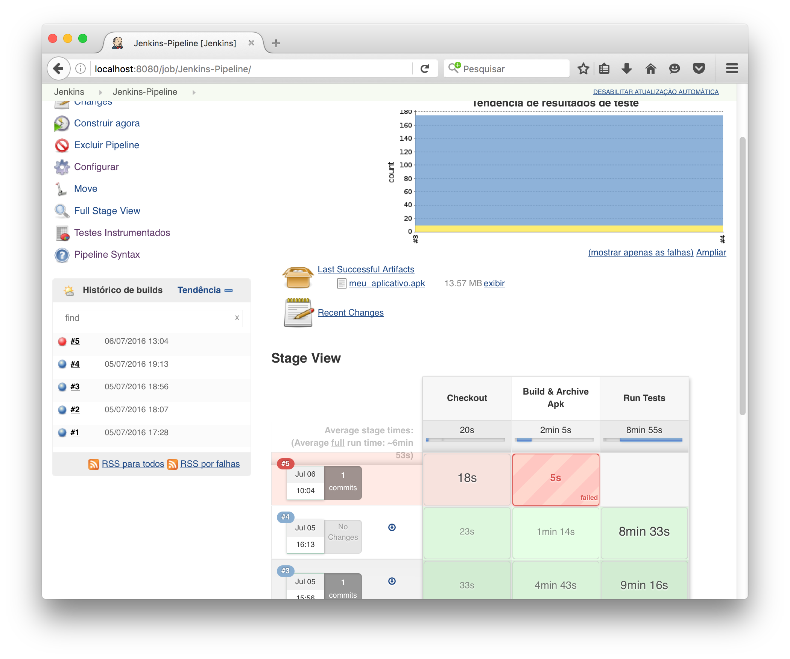

Como visto, o step *Build & Archive Apk* quebrou, e o stage *Run Tests* não foi executado.

Após correções no código, executamos novamente.

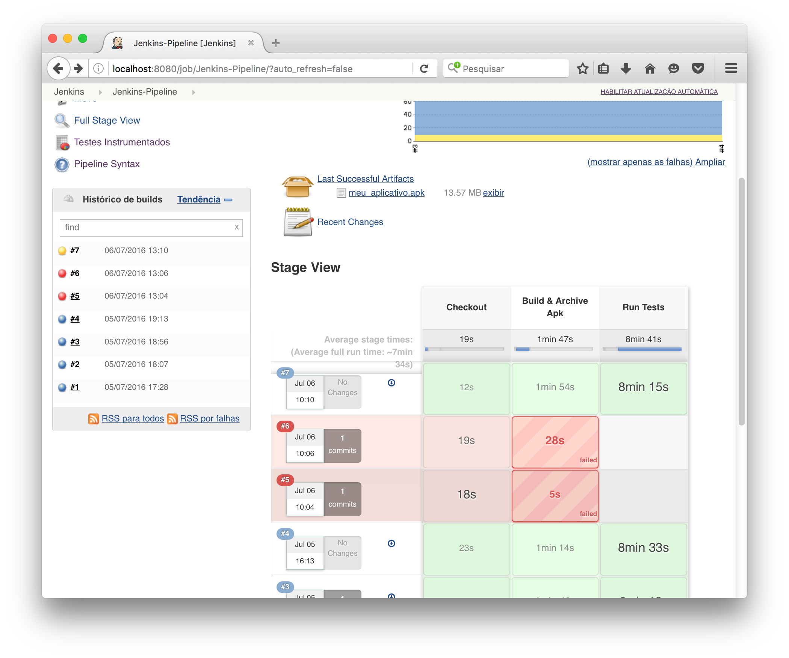

Os stages voltam à executar após correção do build, e mantém o histórico dos builds que quebraram.

* Obs.: É possível tratar a quebra dos stages com script, caso queira por exemplo arquivar artefatos ou passar para o stage seguinte mesmo com a quebra do anterior. 

#### Bônus

Ao criar um job de Pipeline no Jenkins, aparece uma opção chamada **Pipeline Syntax**, que ajuda muito quem está começando à trabalhar com Pipeline feito com código.

Olha alí no final... Clica lá!!

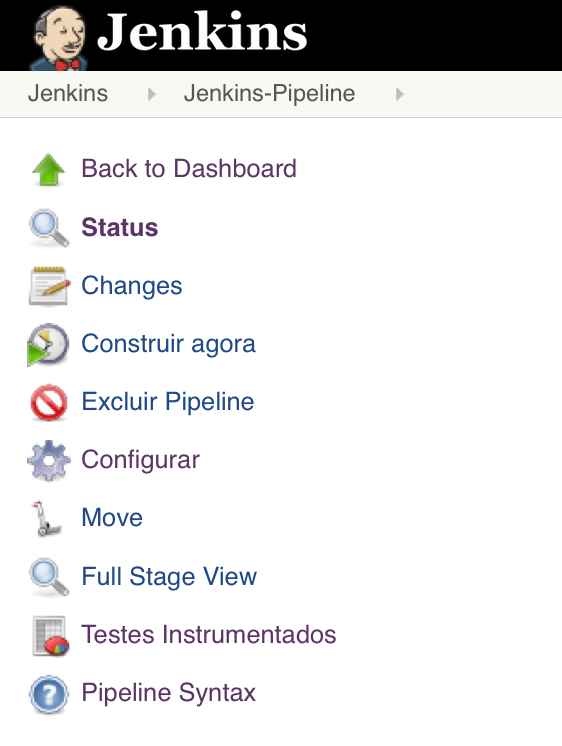

Funciona assim:

- Em **Sample Step** você seleciona o que pretende fazer.
- Os campos mudam de acordo com a opção escolhida. 
- Preencha de acordo com o desejado e clique em **Generate Groovy**.

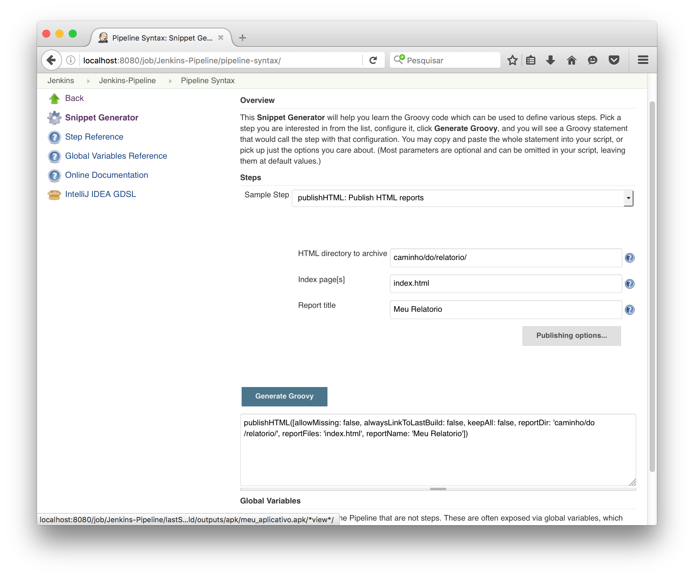

No exemplo foi utilizado o step do plugin **HTML Publisher plugin**, onde foi informado o caminho dos arquivos HTML, a página inicial e o nome que o relatório terá quando for publicado. 

Agora é só copiar o código gerado e utilizar dentro dos stages no Jenkinsfile de acordo com sua necessidade.

	publishHTML([allowMissing: false, alwaysLinkToLastBuild: false, keepAll: false, reportDir: 'caminho/do/relatorio/', reportFiles: 'index.html', reportName: 'Meu Relatorio'])
	

* Obs.: Quanto mais plugins instalados no Jenkins, mais opções para gerar o código em Groovy.

Bom pessoal, por enquanto é isso. Espero que tenham gostado!

Um abraço! 